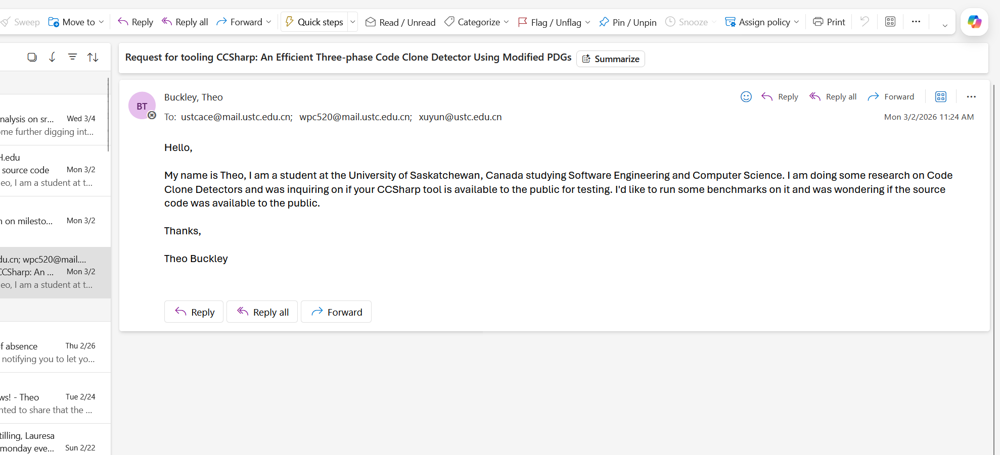

# milestone3cmpt-the-coders
Milestone 3 for team the coders

Csharp
Ran by: Theo

How the official artifact was discovered:

There was not an existing artifact for 'CCSharp

The paper was found using google scholar and I found 2 main sources:
https://ieeexplore.ieee.org/stamp/stamp.jsp?tp=&arnumber=8305932

and
https://www.connectedpapers.com/main/c2834b153786952eedf238ff127e1bbaf26067be/CCSharp%3A-An-Efficient-Three%20Phase-Code-Clone-Detector-Using-Modified-PDGs/graph

(this one just led to IEEE)

This was found by simply googline 'CCsharp clone detector' and looking at the IEEE and connect papers article. You could do the same on google scholar and it would pop up.

I went pretty deeply into googling this for artifacts but didn't find anything major. I looked
at the main authors pages or personal websites on google by looking up the author's names on googles and their associated university.

Here's what I found by searching "Min Wang CCSharp" and looking up each author followed "University of China":
Min wang:
https://wmyolanda.github.io/
https://www.semanticscholar.org/author/Min-Wang/143894230?sort=pub-date
https://www.researchgate.net/profile/Min-Wang-264

"Pengcheng Wang CCSharp":
https://www.sustech.edu.cn/en/faculties/pengchengwang.html

"Yun Xu CCSharp":
http://staff.ustc.edu.cn/~xuyun/

I sadly wasnt' able to find any artifacts from any of their githubs or personal websites. I had emailed the authors a week ago but sadly did not get a response:

Environment setup details:
N/A but would've been Ubuntu 24.04 if I was able.

Installation and execution steps:
N/a

Benchmark(s) used:
N/a but would've used Google Code Jam to cover all the type 1,2,3,4.

Any interventions performed:

N/A no official artifacts were found

Execution outcome and TES classification:
TES-D Non executable since no artifacts were found

