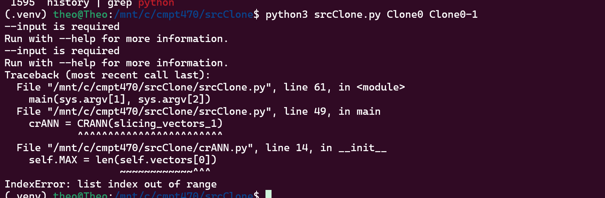

# Srcclone

Ran by: Theo

# How the official artifact was discovered:

There is no existing official artifact for this repo. Main linking used to find information on this paper was through IEEE:
 https://ieeexplore.ieee.org/document/10186836

Further research was done on both authors main  Hakam W. Alomari and Matthew Stephan
but that did not bear fruit. Upon further research I discovered a program called srcVUL which was written by Hakam W. Alomari that used a similar PDG slicer as srcclone, however this was not EXACTLY the same as srcclone and I decided it was not worth pursuing due to it not being inherent to the paper. 

Upon further research I found a thirdparty remake of srcClone:
https://github.com/siriuswhiter/srcClone

This was found through googling and therefore does not have any official linking between the two, it simply implies it is a third party remake using srcClones techniques. This was found by simply googling 'srcclone repo' and I found it.

Digging into the projects of the author of this srcClone hints at this being a paper reproduction:

https://github.com/siriuswhiter

Once again this is not an official repo and thus should not be taken as fact when comparing it's benchmark results.

I attempted to use this third party rather than viewing this as completely non-executable but it yielded limited results, you can see below.

# Environment setup details:

Ubuntu 24.04, Ryzen 9950x3d, 64gb of DDR5 Ram.

Ran locally on my machine to attempt best results.

# Installation and execution steps:

Installation included the following steps, they aren't perfectly in order as debugging
walks through them more. I go in more detail in the "interventions" piece below.

- Install the srcslice tar using tar-xvf
- Download the srcslide tar vile
- Execute the srcslide make file using the guides for srcslide
- fix any dependencies from above ^ (lib nlohmann, lhash3 )
- Move srcslide tar into /bin and /share (install on linux)
- Download srcml debian
- Move srcml into /bin and /share (install on linux) # This failed.
- run the debian: 'sudo dpkg -i srcml-dev_1.1.0-1_ubuntu24.04_amd64\(1\).deb'
- As well as the dev debian: 'sudo dpkg -i srcml-dev_1.1.0-1_ubuntu24.04_amd64\(1\).deb'
- Download and unzip the semantic benchmark into srcClone
- Copy out some standalone clones (I did Clone0 to start, never got further)
- Execute 'python3 srcClone.py Clone0 Clone0-1' with the clone. (This lead to errors)

# Benchmark(s) used:

Semantic clones: SemanticCloneBench: https://drive.google.com/file/d/1KicfslV02p6GDPPBjZHNlmiXk-9IoGWl/view Links to an external site. Paper: https://clones.usask.ca/pubfiles/articles/Omari_SemanticClonesBenchIWSC2020.pdf

My reason for semantic clones is as stated in the publication, srcClone was mainly
used for type-4 clones and semantic clones closely links this in it's C/C++ code.
Furthermore semantic clones has C code which can be executed theoritically. They technically
weren't ran but this would've been used had it functioned.

# Any interventions performed:

- Had to install six
- had to install numpy
- had to install srcslice (not trivial)
- had to install srcml (not trivial)

- Had to install srcslice c++ binaries and 'make' them, this had some issues including improper libraries installed by default and not alerting the developer of these dependencies, I fixed them all manually including:
- sudo apt install nlohmann-json3-dev
- I also had to modify the cmake as it wasn't up to date with its library requirements.

- Had to walk through and manually install srcml in /bin/ due to some conflictions on the initial compilation, I had to rewrite some of the make to get it work with my linux.

- After executing the program with my dummy clone sourced from semantic clones: Here's the outcome that occured:
](image.png)

The initial attempt was using Clone0 from semantic clones and i broke it off into two
functions so that it can 'detect the clone'. This wasn't functional as srcml no longer functions with this system.

# Execution outcome and TES classification:

This was marked as TES-D even though the 'java' implementation test functions.
'python3 runtest.py 2>/dev/null'

The reason being this java is outside the scope of the original paper however, as their slicer was never designed to do anything but C/C++. The C code as described above was non-functional and thus it gets TES-D since technically this isn't a part of the official paper and the third party source code isn't functional, it would require major intervention outside the scope of the project, including a whole re-write of the slicer and srcml library usage.

I've added my test data that I used to attempt to get it work in 'Clone0' and 'Clone-0-1'

I could only get the program to execute on it's basic tests that exists in the repo. I could not get it to activate on the semantic clones due to the complex parsing needed to get this working.

You can see my executions in the 'image.png' attached.

WARNING/TODO:
Don't forget to add logs, error traces and screenshots for any outcomes found. The more the merrier

